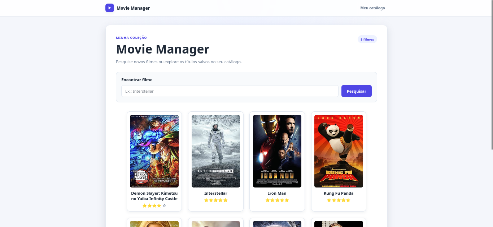
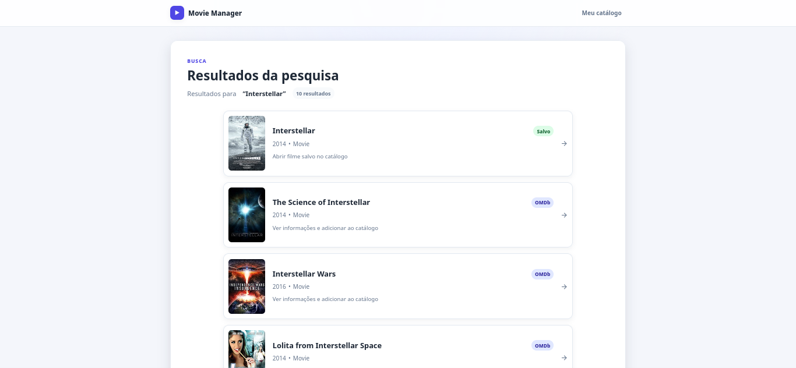
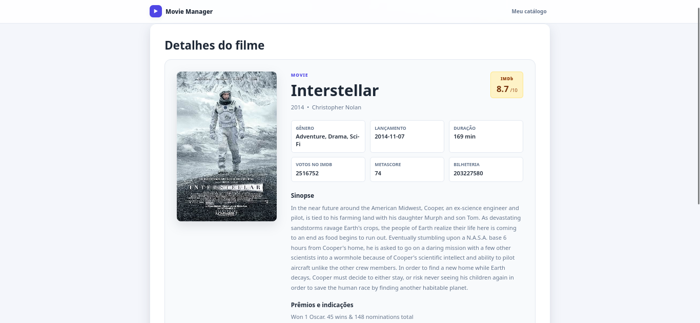
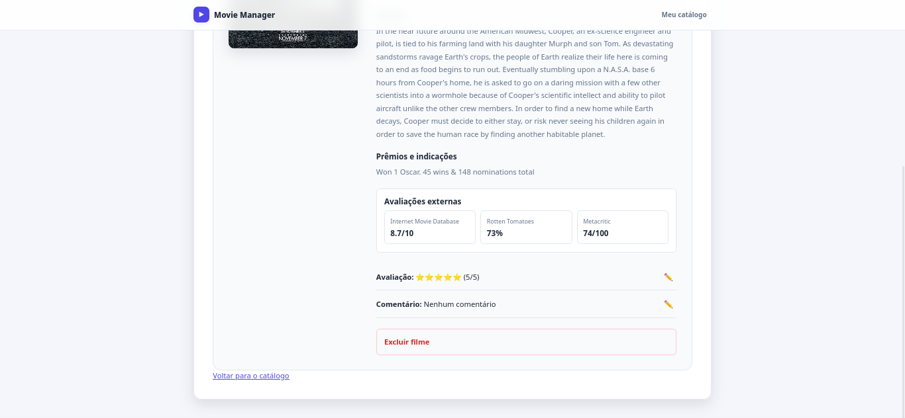

# 🎬 Movie Manager

[](https://github.com/eduardo-saiter/movie-manager-python/actions/workflows/tests.yml)

Movie Manager is a local-first Python application for searching movies through the OMDb API and organizing a personal SQLite catalog.

It provides two interfaces over the same application logic:

- a web interface built with FastAPI, Jinja2, HTML, and CSS;
- a command-line interface for terminal use.

Users can search partial titles, combine local and OMDb results, save movies, rate them, write personal comments, view detailed metadata, and remove items from the catalog.

---

## Contents

- [Screenshots](#screenshots)
- [Features](#features)
- [Search flow](#search-flow)
- [Architecture](#architecture)
- [Technologies](#technologies)
- [Project structure](#project-structure)
- [Installation](#installation)
- [Configuration](#configuration)
- [Running the application](#running-the-application)
  - [Web interface](#web-interface)
  - [Command-line interface](#command-line-interface)
- [Main web routes](#main-web-routes)
- [Validation and error handling](#validation-and-error-handling)
- [Tests](#tests)
- [Concepts practiced](#concepts-practiced)
- [Roadmap](#roadmap)
- [License](#license)

---

## Screenshots

### Catalog



### Search results



### Movie details





---

## Features

### Catalog

- Store movies in a local SQLite database
- Display saved titles in a responsive card grid
- Open movie details by clicking a poster or title
- Rate movies from 0 to 5 stars
- Add and update personal comments
- Delete movies from the catalog
- Prevent duplicate IMDb IDs with a case-insensitive `UNIQUE` constraint

### Search and OMDb integration

- Search partial titles in the local catalog
- Search external titles through the OMDb API
- Merge local and external results
- Remove duplicate results using the IMDb ID
- Redirect saved results to their local detail page
- Open unsaved results on an OMDb detail page
- Save external results to the local catalog
- Display posters, release information, runtime, ratings, votes, awards, and other metadata

### Reliability

- Validate empty searches, ratings, comments, and missing movie IDs
- Handle API timeouts, connection failures, and invalid responses
- Display user-friendly error messages
- Return appropriate HTTP status codes
- Keep the local catalog available when the OMDb key is not configured
- Reuse the same service and repository layers in the web and terminal interfaces

---

## Search flow

```text
User searches for part of a title
             │
       ┌─────┴─────┐
       ▼           ▼
Local SQLite    OMDb search
results         results
       └─────┬─────┘
             ▼
Merge by IMDb ID and remove duplicates
             │
       ┌─────┴─────┐
       ▼           ▼
Saved item     External item
/movies/{id}   /omdb/{imdb_id}
```

---

## Architecture

The project uses a layered architecture to separate HTTP handling, application rules, API communication, persistence, and presentation.

```text
Browser
   │
   ▼
FastAPI application
web_app.py
   │
   ▼
Router / controllers
routers/movie_router.py
   │
   ▼
MovieServices
   ├────────► MovieApiClient ─────► OMDb API
   │
   └────────► MovieRepository ────► SQLite
                     │
                     ▼
                   Models
```

The command-line interface uses the same application layer:

```text
main.py ─────► MovieServices ─────► Repository / API client
```

### Main responsibilities

| Component | Responsibility |
|---|---|
| `web_app.py` | Creates and configures the FastAPI application |
| `routers/movie_router.py` | Defines routes and handles HTTP requests and responses |
| `web_dependencies.py` | Creates templates, database connections, repositories, API clients, and services |
| `services/movie_services.py` | Applies validation and coordinates application rules |
| `repositories/movies_repository.py` | Performs SQLite persistence operations |
| `clients/movie_api_client.py` | Communicates with the OMDb API |
| `database/database.py` | Creates SQLite connections and initializes the schema |
| `models/` | Defines media, movie, search-result, series, episode, and external-rating models |
| `mappers/omdb_mapper.py` | Converts OMDb payloads into application models |
| `templates/` | Contains the Jinja2 HTML pages |
| `static/` | Contains the application styles |
| `utils/exhibition.py` | Formats output for the command-line interface |

---

## Technologies

| Area | Technology |
|---|---|
| Language | Python 3.10+ |
| Web framework | FastAPI |
| Development server | Uvicorn |
| Templates | Jinja2 |
| Front end | HTML and CSS |
| Database | SQLite |
| HTTP client | Requests |
| Environment variables | python-dotenv |
| Testing | Pytest and pytest-cov |
| Continuous integration | GitHub Actions |

---

## Project structure

```text
movie-manager-python/
├── .github/
│   └── workflows/
│       └── tests.yml
├── clients/
│   └── movie_api_client.py
├── database/
│   └── database.py
├── docs/
│   └── images/
│       ├── catalog.png
│       ├── search_results.png
│       ├── movie_details_01.png
│       └── movie_details_02.png
├── mappers/
│   └── omdb_mapper.py
├── models/
│   ├── media.py
│   ├── movie.py
│   ├── series.py
│   ├── episode.py
│   ├── media_search_result.py
│   └── external_rating.py
├── repositories/
│   └── movies_repository.py
├── routers/
│   └── movie_router.py
├── services/
│   └── movie_services.py
├── static/
│   └── styles.css
├── templates/
│   ├── base.html
│   ├── index.html
│   ├── search_results.html
│   └── details_data.html
├── tests/
│   ├── conftest.py
│   ├── test_database.py
│   ├── test_exhibition.py
│   ├── test_integration_flow.py
│   ├── test_main.py
│   ├── test_movie_api_client.py
│   ├── test_movie_services.py
│   ├── test_movies_repository.py
│   ├── test_omdb_mapper.py
│   ├── test_web_app.py
│   └── test_web_dependencies.py
├── utils/
│   └── exhibition.py
├── .coveragerc
├── .env.example
├── errors.py
├── LICENSE
├── main.py
├── README.md
├── requirements-dev.txt
├── requirements.txt
├── web_app.py
└── web_dependencies.py
```

---

## Installation

### 1. Clone the repository

Using SSH:

```bash
git clone git@github.com:eduardo-saiter/movie-manager-python.git
cd movie-manager-python
```

Using HTTPS:

```bash
git clone https://github.com/eduardo-saiter/movie-manager-python.git
cd movie-manager-python
```

### 2. Create a virtual environment

```bash
python3 -m venv .venv
```

### 3. Activate the virtual environment

Linux or macOS:

```bash
source .venv/bin/activate
```

Windows PowerShell:

```powershell
.venv\Scripts\Activate.ps1
```

### 4. Install dependencies

Application dependencies:

```bash
python -m pip install --upgrade pip
python -m pip install -r requirements.txt
```

Development and test dependencies:

```bash
python -m pip install -r requirements-dev.txt
```

---

## Configuration

Copy the environment example:

```bash
cp .env.example .env
```

Add your OMDb API key:

```env
OMDB_API_KEY=your_api_key
```

The `.env` file is ignored by Git and must not be committed.

The local catalog remains available without an API key, but external OMDb searches require one.

---

## Running the application

### Web interface

Start the FastAPI development server:

```bash
python -m fastapi dev web_app.py
```

Open:

```text
Application: http://127.0.0.1:8000
API docs:    http://127.0.0.1:8000/docs
```

#### Access from another device on the same network

Start Uvicorn on all network interfaces:

```bash
python -m uvicorn web_app:app --host 0.0.0.0 --port 8000
```

Find the computer's local IP address on Linux:

```bash
hostname -I
```

Then open:

```text
http://YOUR_LOCAL_IP:8000
```

The application has no authentication and is intended for local development. Do not expose it directly to an untrusted public network.

### Command-line interface

```bash
python main.py
```

The SQLite database is created automatically inside the `database/` directory.

---

## Main web routes

| Method | Route | Purpose |
|---|---|---|
| `GET` | `/` | Display the saved movie catalog |
| `GET` | `/search?title=...` | Combine partial local and OMDb search results |
| `GET` | `/omdb/{imdb_id}` | Display complete details for an OMDb result |
| `POST` | `/movies/save` | Save a movie returned by the API |
| `GET` | `/movies/{movie_id}` | Display a saved movie by ID |
| `POST` | `/movies/{movie_id}/update-rating` | Update a movie rating |
| `POST` | `/movies/{movie_id}/update-comment` | Update a personal comment |
| `POST` | `/movies/{movie_id}/delete-movie` | Delete a saved movie |

---

## Validation and error handling

The service layer validates application data before calling the repository.

Examples:

- titles cannot be empty;
- ratings must be integers between 0 and 5;
- comments cannot be empty or longer than 500 characters;
- operations with unknown movie IDs are rejected;
- duplicate IMDb IDs are blocked by SQLite;
- OMDb timeouts and connection failures become user-friendly messages;
- database errors are handled without exposing technical details to the user;
- web routes return status codes such as `400`, `404`, `409`, and `503`.

---

## Tests

The project contains **153 automated tests** covering the main application layers and user flows.

Run the complete suite:

```bash
pytest -q
```

Run with coverage:

```bash
pytest --cov=. --cov-report=term-missing -q
```

Current local result:

```text
153 passed
```

Current measured coverage:

```text
approximately 82%
```

The suite covers:

- database initialization, constraints, and foreign keys;
- OMDb client behavior without real network requests;
- SQLite repository operations using isolated in-memory databases;
- service rules and validation;
- mapper behavior;
- web routes, forms, redirects, templates, and HTTP status codes;
- complete integration flows;
- terminal output and shutdown behavior.

Mocks and in-memory SQLite databases keep the suite independent from the real OMDb API and the local application database.

The GitHub Actions workflow runs the tests automatically on pushes and pull requests targeting `main`.

---

## Concepts practiced

- Object-oriented programming
- Dataclasses
- Type hints
- Layered architecture
- Separation of concerns
- Repository pattern
- Service layer
- Router and controller organization
- Dependency injection
- REST API consumption
- HTTP methods and status codes
- FastAPI forms, query parameters, and path parameters
- Jinja2 templates
- Responsive HTML and CSS
- Environment variables
- SQLite CRUD operations
- Transactions and foreign keys
- Validation and exception handling
- Pytest fixtures, mocks, monkeypatch, and parametrization
- Continuous integration with GitHub Actions

---

## Roadmap

- [x] Use FastAPI `Depends()` for dependency injection
- [x] Create a dedicated movie-detail template
- [x] Use the IMDb identifier as the primary uniqueness rule
- [x] Add automated tests with GitHub Actions
- [x] Improve accessibility and responsive styling
- [x] Add screenshots to the repository
- [ ] Add database migrations
- [ ] Add pagination and catalog filters
- [ ] Complete series and episode workflows
- [ ] Add authentication before any public deployment

---

## License

This project is distributed under the terms described in the [LICENSE](LICENSE) file.
